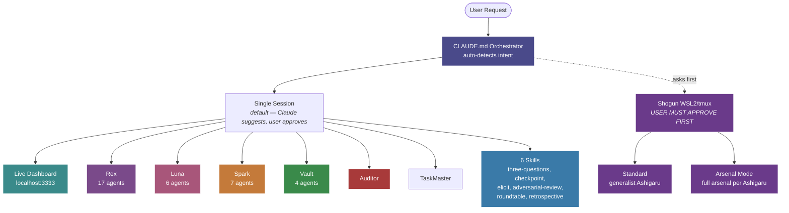
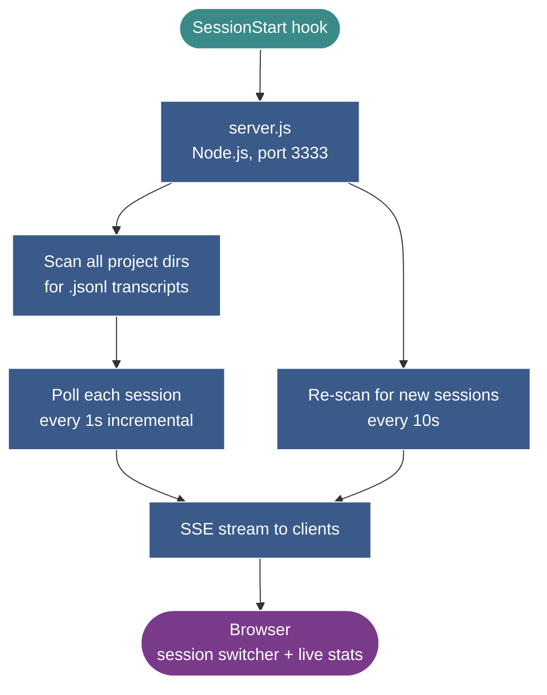
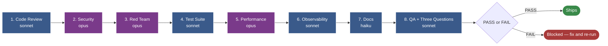
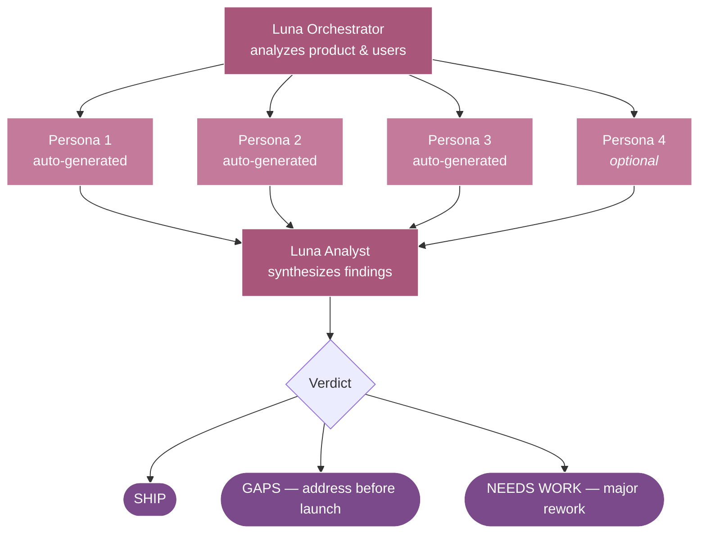
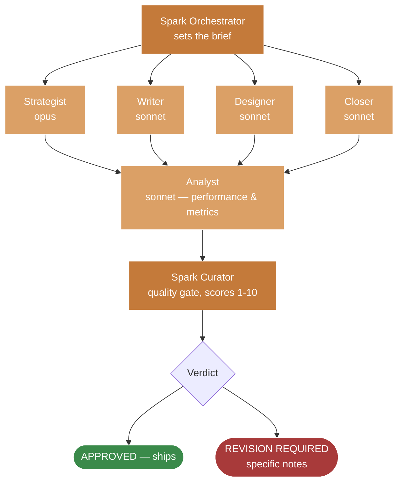
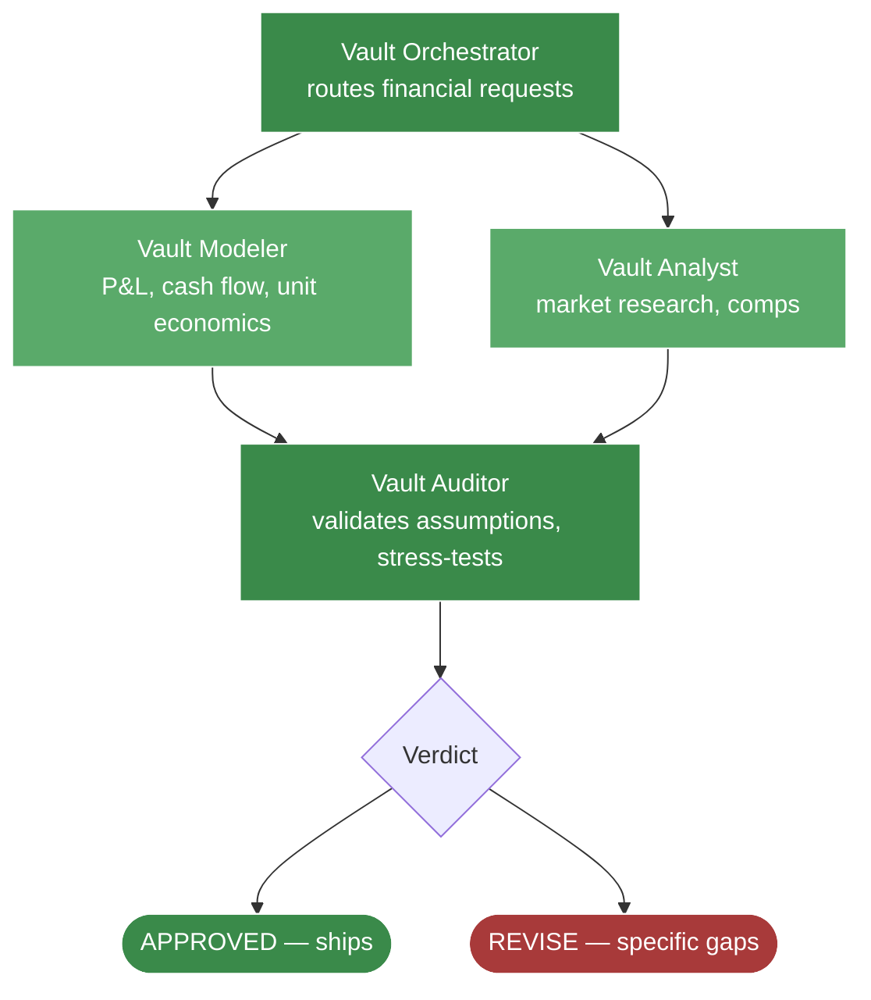
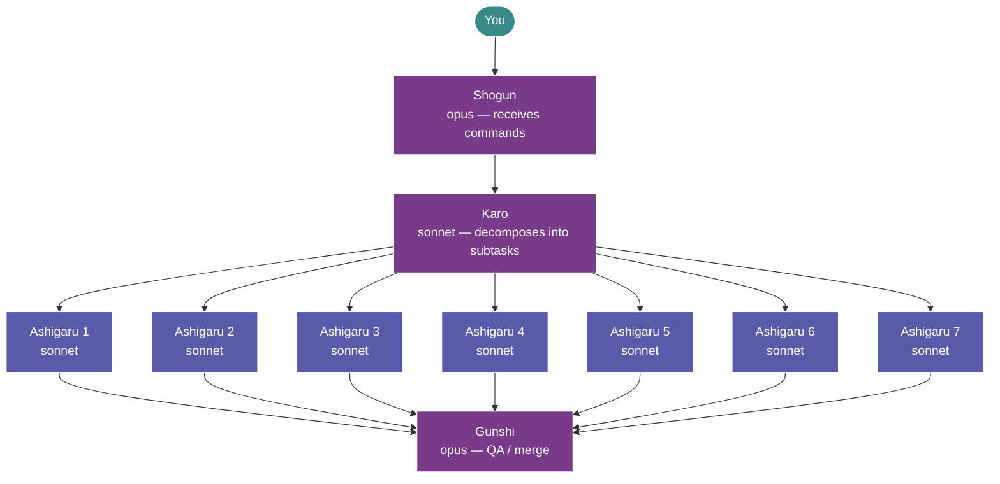

<h1 align="center">Claude Arsenal</h1>

<p align="center">
  <em>A production-grade multi-agent system for Claude Code.<br/>
  Engineering standards enforced automatically, every session.</em>
</p>

<p align="center">
  <strong>Agents</strong>&nbsp;
  
  
  
  
  
  
</p>

<p align="center">
  <strong>Discipline</strong>&nbsp;
  
  
  
  
</p>

<p align="center">
  <strong>Ecosystem</strong>&nbsp;
  
  
  
  
</p>

<p align="center">
  <strong>Status</strong>&nbsp;
  
  
  
  
  
</p>

<p align="center">
  <strong>40 agents</strong> &middot; <strong>6 skills</strong> &middot; <strong>23 plugins</strong> &middot; <strong>15 hooks</strong> &middot; <strong>8 MCP servers</strong> &middot; <strong>live dashboard</strong> &middot; <strong>full audit trail</strong>
</p>

<p align="center">Built by <a href="https://github.com/hgonzalezstahl-blip">Hector Gonzalez-Stahl</a></p>

---

## Why this arsenal?

Most AI coding setups optimize for the first ten minutes — fast prompts, fast generation, fast results. They break at the seams: state lives in two places, observability is missing, parallel agents make conflicting choices, and the human shipping the code can't answer "what breaks if I delete this?"

This arsenal is built around the opposite premise: **systems thinking is the skill, not prompting.** Every layer — the agents, the skills, the gates, the hooks — exists to keep the discipline visible while AI does the typing.

| Principle | What it means in practice |
|---|---|
| **Theory before code** | `rex-architect` writes ADRs before parallel sub-agents touch the codebase. No silent conflicts at integration time. |
| **Comprehension over speed** | After autonomous work completes, `checkpoint` walks the human through the change in concern-order with blast-radius hotspots. |
| **The Three Questions gate** | Code that compiles but cannot answer state / feedback / blast radius FAILs `rex-qa`. Coherent or not done. |
| **Adversarial discipline** | Reviewers must find issues. "Looks good" is not allowed. Applied to specs, plans, prose, and agent definitions — not just code. |
| **Multiple lenses, one decision** | `roundtable` convenes Vault + Spark + Luna + Scout (or any cast) to debate cross-domain decisions instead of picking the one orchestrator's view. |
| **Memory that compounds** | `retrospective` writes durable lessons (feedback / project / reference) so the same mistake doesn't repeat across sessions. |
| **Audit by default** | Every agent spawn, every tool call, every Stop event is logged. Cost and context tracked per session, model-tier-aware. |

---

## Quick Reference — What to Say

You don't need to learn agent names. Say what you want; the orchestrator routes. A few examples:

<table>
<tr>
<th align="left">When you say...</th>
<th align="left">What fires</th>
</tr>
<tr>
<td><code>start</code> / <code>continue</code> / <code>next module</code> in Rekaliber</td>
<td><strong>Rex</strong> orchestrator → ITERATION SEQUENCE on STATE.md</td>
</tr>
<tr>
<td>Paste a stack trace from NestJS / Prisma / Next.js</td>
<td><strong>Rex Debugger</strong> → root-cause + fix</td>
</tr>
<tr>
<td><code>is this good UX?</code> / <code>would users get this?</code></td>
<td><strong>Luna</strong> → spawns 2-4 dynamic personas + analyst synthesis</td>
</tr>
<tr>
<td><code>should we charge for this?</code> / <code>price the X</code></td>
<td><strong>Vault</strong> → modeler + analyst + auditor on the pricing</td>
</tr>
<tr>
<td><code>write a launch post</code> / <code>cold outreach for X</code></td>
<td><strong>Spark</strong> → strategist or writer → curator quality gate</td>
</tr>
<tr>
<td><code>I built this in Lovable, is it safe?</code></td>
<td><strong>Auditor</strong> → 7-layer structural audit with plain-English impact</td>
</tr>
<tr>
<td><code>stress test this</code> / <code>pre-mortem on this plan</code></td>
<td><strong>elicit</strong> skill → picks one of 9 reasoning methods</td>
</tr>
<tr>
<td><code>walk me through what I just shipped</code></td>
<td><strong>checkpoint</strong> skill → concern-ordered walkthrough + hotspots</td>
</tr>
<tr>
<td><code>what does everyone think?</code> / <code>convene the team</code></td>
<td><strong>roundtable</strong> skill → 3-5 orchestrators debate in one session</td>
</tr>
<tr>
<td><code>tear this apart</code> / <code>find the holes</code></td>
<td><strong>adversarial-review</strong> skill → must-find-issues review</td>
</tr>
<tr>
<td><code>save the learning</code> / after external feedback comes in</td>
<td><strong>retrospective</strong> skill → writes durable memory entries</td>
</tr>
<tr>
<td><code>tailor my resume for this job</code> + paste JD</td>
<td><strong>Pitch</strong> → master CV → tailored resume + cover letter</td>
</tr>
<tr>
<td><code>write me a [essay / email / post]</code></td>
<td><strong>Echo</strong> → ghostwrites in your voice with AI-tell scrub</td>
</tr>
</table>

Working-directory match wins over phrasing: anything inside `~/rekaliber` routes to Rex regardless of trigger words.

---

## Table of Contents

- [What's New](#whats-new) — version history
- [Quick Start](#quick-start) — install + first run
- [What's Inside](#whats-inside) — directory tree
- [System Architecture](#system-architecture) — request → orchestrator → agent flow
- [Live Session Dashboard](#live-session-dashboard) — real-time monitoring
- **Agents**
  - [Rex](#rex--project-orchestration-engine) — 17 agents, full engineering lifecycle
  - [Luna](#luna--dynamic-persona-testing) — dynamic UX persona testing
  - [Spark](#spark--creative--marketing-agency) — 7 agents, full marketing team
  - [Vault](#vault--financial-analysis-team) — 4 agents, financial modeling
  - [Auditor](#auditor--external-codebase-audit) — non-Rekaliber audit specialist
  - [General Purpose](#general-purpose-agents) — planning, intelligence, simulation
- [Skills](#skills--portable-discipline) — 6 user-built skills (systems thinking)
- [Infrastructure](#infrastructure-layer) — hooks, rules, plugins, MCP, knowledge vault
- [Shogun](#shogun--parallel-execution-engine) — 10 parallel agents via tmux
- [Copilot Framework](#copilot-framework-8-skills) — same gates for GitHub Copilot
- [Full Summary](#full-summary) — counts table

---

## What's New

### v5.0.3 — May 3, 2026 (Filename Normalization + Permissions Pruning)

| Change | Details |
|:-------|:--------|
| **`TaskMaster.agent.md` renamed to `taskmaster.md`** | Last non-conforming agent filename in the directory. Now matches the lowercase / no-infix convention every other agent follows. The frontmatter `name: TaskMaster` is preserved, so all CLAUDE.md routing references continue to work — the rename is loader-transparent. |
| **`settings.local.json` pruned** | 275 entries → 86. Removed: ~190 one-shot scaffold entries (e.g., specific `npx create-next-app ...` commands, project-specific `find` invocations, completed `mkdir` setups), malformed entries (`Bash(2)`, `Bash(do cp:*)`, `Bash(done)`, `Bash(for skill:*)`), and the `Bash(rm -rf apps/docs apps/web)` entry the audit flagged as a latent risk. Kept: broad wildcards (`Bash(npm:*)`, `Bash(git:*)`, `Bash(vercel:*)`, `Bash(qmd:*)`, etc.) that consolidate dozens of subcommand-specific entries; all configured MCP permissions; trusted WebFetch domains. Net result: same operational coverage, ~70% smaller surface for accidental matches. |

### v5.0.2 — May 3, 2026 (Coordination Drift Cleanup)

| Change | Details |
|:-------|:--------|
| **ADR ownership conflict resolved** | `rex-docs` previously claimed to write Architecture Decision Records to `./agents/DECISIONS.md` while `rex-architect` writes them to `docs/adr/NNNN-name.md` per `solutioning-adr.md`. Edited `rex-docs` to write only **module-level decision logs** (lighter scope) and explicitly defer ADRs to `rex-architect`. The whole solutioning-gate discipline depended on a single source of truth — now it has one. |
| **Dead HTTP hooks stripped** | `settings.json` was firing 14+ hook events to `http://localhost:3001/hooks/claude` — a service that doesn't exist (the dashboard is on port 3333). Removed all dead HTTP fan-out (SessionStart, PreToolUse, PostToolUse, Stop, PostToolUseFailure, StopFailure, SubagentStart, SubagentStop, SessionEnd, TeammateIdle, TaskCompleted, WorktreeCreate, WorktreeRemove, Elicitation). Working hooks (bash/node command type) preserved. |
| **ADR enforcement wired into rex sub-agents** | `solutioning-adr.md` said "all rex sub-agents read this" — but the prompts didn't reference it. Added explicit `## ADR PROTOCOL` section to `rex-backend`, `rex-frontend`, `rex-database`, `rex-integration`, `rex-tester` (read ADR first, cite it in status, never silently deviate). Added `### 0. ADR Compliance` checklist to `rex-reviewer` so non-compliance bounces back. Added `### 2.5 Solutioning Gate (ADR check)` to `rex-rekaliber-orchestrator` so multi-module work commissions an ADR before delegation. |
| **`spark-closer` orphan adopted** | Sales agent existed as a file but was missing from `spark.md`'s YOUR TEAM table — orchestrator couldn't spawn it. Added to the table; sales requests now route correctly. |
| **Luna fixed personas marked REFERENCE ONLY** | `luna-host.md`, `luna-guest.md`, `luna-owner.md` had agent frontmatter that made them discoverable as spawnable agents, despite Luna's design treating them as reference anchors for the Persona Factory. Updated descriptions to make the boundary explicit. |
| **`knowledge/README.md` qmd alignment** | Replaced stale `knowledge-rag MCP server` reference with `qmd MCP server`. Added explicit `qmd embed` / `qmd update` setup steps and example queries. |
| **`auditor.md` jcodemunch gated** | Was unconditionally listing `jcodemunch MCP` as available — but it's not configured. Now gated behind "if configured" like every other agent's reference to it. |
| **`rex-redteam` added to orchestrator delegation** | `rex-rekaliber-orchestrator.md` SUPPORT AGENTS table now includes `rex-redteam` so multi-step orchestrations can chain into adversarial prompt testing. |
| **Scope boundaries** | `arsenal-optimizer` (audits `~/.claude/`) and `agentic-architect` (audits any project's agent infrastructure) now declare their scope boundary inside their own prompts — no longer a CLAUDE.md-only soft rule. |
| **Smaller drifts swept** | `pitch.md` "five files" → "seven files" off-by-two; `multi-sim.md` got missing `color:` field; `arsenal_systems_thinking_2026_04_27.md` memory updated with current roundtable cast (Auditor + TaskMaster added). |
| **Open: TaskMaster filename** | `TaskMaster.agent.md` still uses non-standard CamelCase + `.agent.md` infix. Frontmatter `name:` field is what the loader uses, so functional, but the convention break remains. Audit recommends rename to `taskmaster.md` — pending user decision. |
| **Open: permission list pruning** | `settings.local.json` has 277 entries; audit identified ~50 reusable patterns and ~225 one-time/stale entries safe to prune. Pending dedicated session. |

Full audit report saved to `reports/arsenal-audit-2026-05-03-full.md`.

### v5.0.1 — May 3, 2026 (Configuration Hotfixes)

| Change | Details |
|:-------|:--------|
| **`TaskMaster.agent.md` frontmatter** | Added missing `model: opus`, `effort: high`, `color: cyan`. Was previously loading at default tier — every other orchestrator (Rex, Luna, Spark, Vault, Auditor, Scout) declares opus + high explicitly. Now consistent. |
| **`CLAUDE.md` knowledge pointer** | Replaced stale `knowledge-rag MCP server` reference with the actual server name `qmd MCP server (local markdown index)`. The `knowledge-rag` server was never wired up; `qmd` is what the RAG layer has been running on since v3. |
| **`CLAUDE.md` Shogun launch commands** | Replaced `[your-wsl-user]` placeholders with `hgonz` (lines 137–138). Commands were previously copy-paste-broken if anyone ran them verbatim. |
| **`CLAUDE.md` Shogun repo URL** | Replaced `[your-username]` placeholder with `hgonzalezstahl-blip` (line 136). Now points at the actual fork at `github.com/hgonzalezstahl-blip/multi-agent-shogun`. |
| **Open: `TaskMaster.agent.md` filename** | Uses `.agent.md` infix and CamelCase while every other agent uses `lowercase-name.md`. Pending: full audit will check whether rename is safe (no broken references). |

### v5 — April 27, 2026 (Systems-Thinking Layer + BMAD-Inspired Discipline)

| Change | Details |
|:-------|:--------|
| **6 user-built skills** | `elicit` (9 reasoning methods incl. pre-mortem), `checkpoint` (concern-ordered walkthrough after autonomous work), `roundtable` (multi-orchestrator debate), `adversarial-review` (force-find-issues for non-code artifacts), `retrospective` (writes durable feedback memory), `three-questions` (state / feedback / blast radius gate). All auto-invoke on context match. |
| **New `auditor` agent** | Read-only structural audit for codebases the user did not write — Lovable, Bolt, Cursor, v0, inherited. 7-layer protocol (architecture, safety, data integrity, observability, failure modes, scaling, maintainability). Severity-tagged findings, plain-English impact for non-tech founders, continue / patch / rebuild / hire recommendation. Auto-declines Rekaliber audits. |
| **`rex-qa` gains Three Questions gate** | Step 8 added. Code that compiles but cannot answer state / feedback / blast radius now FAILs QA. Coherent or not done. |
| **`rex-architect` gains ADR generation** | Mandatory Architecture Decision Records before any multi-module / multi-agent feature. Prevents parallel sub-agents from making conflicting technical choices. Includes a worked example (timezone handling) so generated ADRs have an anchor for specificity. Bumped to `effort: high`. |
| **Solutioning rule** | New `rules/solutioning-adr.md` — cross-agent contract that all rex sub-agents read before generating code on multi-module work. |
| **`session-report.js` hardened** | Model-tier-aware cost calc (Opus / Sonnet / Haiku detected from transcript). Cache write cost included in total. Errors logged to `session-reports/errors.log` instead of silently swallowed. |
| **Trigger collisions resolved** | `elicit` vs `adversarial-review` vs `vault-auditor` vs `rex-redteam` vs code reviewers — disambiguated in CLAUDE.md with explicit tiebreakers. Working-directory match (Rekaliber) takes precedence over every other auto-invocation. |
| **Project routing added** | Lean AI app, Lean AI Content Ecosystem, Punto Azul, and one-off Echo/Pitch deliverables now have explicit default-orchestrator routing in CLAUDE.md. |

### v4 — April 22, 2026 (Shogun Integration + Cleanup)

| Change | Details |
|:-------|:--------|
| **Shogun parallel execution** | Safe launcher hook (`shogun-launch.sh`), WSL validation, sensitive file detection, audit logging. Runs 10 agents via tmux — never auto-invoked |
| **Own Shogun repo** | Forked to [hgonzalezstahl-blip/multi-agent-shogun](https://github.com/hgonzalezstahl-blip/multi-agent-shogun) with upstream tracking. READMEs updated to v4.6, English-only |
| **15 hooks** (was 14) | Added `shogun-launch.sh` — pre-launch safety checks for parallel execution |
| **Runtime files untracked** | `settings.json` and `plugins/*.json` removed from git — they auto-update every session with timestamps/cache hashes, causing perpetual dirty state |
| **CLAUDE.md Shogun repo link** | Points to owned repo with upstream reference |

### v3 — April 21, 2026 (Context Optimization + Audit System)

| Change | Details |
|:-------|:--------|
| **8 MCP servers** (was 6) | Added `qmd` (semantic RAG), `jcodemunch` (AST code exploration), `gitmcp` (real GitHub data), `memory` (persistent memory), `pal-mcp` (multi-model access), `claude-mem` (session history) |
| **Knowledge RAG active** | `qmd` indexes `knowledge/` with BM25 + vector embeddings + LLM reranking. 11 docs, 12 chunks. Re-index: `qmd update && qmd embed` |
| **Full audit system** | 14 hooks (was 8): `agent-audit.js` logs every agent spawn, `tool-audit.js` logs every tool call, `session-report.js` generates per-session token/cost reports, `truncate-large-output.sh` alerts on context pressure |
| **Audit summary CLI** | `node ~/.claude/hooks/audit-summary.js [days]` — agent usage by type, tool breakdown, token estimates, cost tracking |
| **Anthropic API optimization rule** | Auto-loads on any file matching `*anthropic*`, `*llm*service*`, `*claude*provider*`. Enforces prompt caching, batch API, token tracking, model selection |
| **Pixel Agents + Ctrl** | Visual agent monitoring via pixel art characters. Ctrl daemon provides real-time token/cost tracking at `ctrl.bulletproof.sh` |
| **claude-mem plugin** | AI-compressed searchable session history across all past conversations. View at `http://localhost:37777`, search with `/mem-search` |
| **23 plugins** (was 22) | Added `claude-mem` for persistent session memory |

### v2.1 — April 20, 2026 (Depth Update)

| Change | Details |
|:-------|:--------|
| **Hooks extracted to scripts** | All 8 hooks moved from inline bash in settings.json to standalone `.sh` files in `hooks/` — testable, versionable, debuggable |
| **Agent validation linter** | `tools/validate-agents.js` — checks all 39 agents for required frontmatter, valid models, required sections, duplicate names. Run as pre-commit or standalone |
| **Knowledge vault seeded** | 3 ADRs (monorepo, response format, multi-tenant), 2 pattern docs (service layer, Prisma conventions), 2 API docs (Stripe gotchas, Prisma quirks) |
| **Rex light-mode gates** | Rex auto-selects FULL (7 gates) or LIGHT (3 gates) based on change scope. Low-risk changes skip security/performance/observability gates. User can override |

### v2 — April 20, 2026

| Change | Details |
|:-------|:--------|
| **Live Session Dashboard** | Real-time multi-session monitor at `localhost:3333` — track tokens, costs, context window, tool calls, and agent invocations across all active sessions with one-click switching |
| **Vault Team** (4 new agents) | `vault`, `vault-modeler`, `vault-analyst`, `vault-auditor` — financial modeling, market sizing, pricing strategy, and audit with 3-scenario analysis |
| **Scout Agent** | Competitive intelligence and market research — monitors competitors, analyzes trends, evaluates technologies, produces structured intel briefs |
| **Spark-Closer Agent** | Sales specialist — proposals, pitch decks, cold outreach sequences, objection handling, and deal analysis |
| **6 Lifecycle Hooks** (was 4) | Added SessionStart dashboard auto-launch, TDD enforcement warnings, and prompt injection detection on file reads |
| **Context Window Fix** | Dashboard now shows actual context fill (last message), not cumulative tokens |
| **39 Agents** (was 33) | 5 teams: Rex (17), Luna (6), Spark (7), Vault (4), General (5) |

### v1 — April 17, 2026

| Change | Details |
|:-------|:--------|
| **Rex Team** (17 agents) | Full engineering lifecycle — build, review, red-team, test, performance audit, deploy |
| **Luna Redesign** | Dynamic Persona Factory generates 2-4 custom personas per evaluation (no fixed roster) |
| **Rex-RedTeam** | 74 attack techniques across 7 categories, aligned with OWASP LLM/Agentic Top 10 |
| **Spark Team** (6 agents) | Full-service marketing agency — strategy, content, design, analytics, curation |
| **22 Plugins** | 13 Trail of Bits security, 8 Anthropic official, 1 community |
| **Path-Scoped Rules** | Auto-loading conventions for NestJS, React, Prisma, Rekaliber |
| **Knowledge Vault** | 3-tier RAG architecture (L1 always-loaded, L2 on-demand, L3 deep reference) |
| **Copilot Framework** | 8 skills ported to GitHub Copilot |
| **Persistent Agent Memory** | All agents have `memory: user` for cross-session learning |

---

## Quick Start

```bash
git clone https://github.com/hgonzalezstahl-blip/claude-arsenal.git
cd claude-arsenal
bash install.sh
```

Restart Claude Code. All 39 agents + the live dashboard are immediately available.

```bash
# Also install orchestration rules + hooks template
bash install.sh --with-claude-md
```

<details>
<summary>Manual Install</summary>

Copy any `.md` file from `agents/` into `~/.claude/agents/`. Done.

For the dashboard: `cp -r dashboard ~/.claude/dashboard`

For Copilot: `cp -r copilot-framework/.github /path/to/your/repo/`
</details>

---

## What's Inside

```
claude-arsenal/
├── agents/
│   ├── rex/                 # 17 project orchestration agents
│   ├── luna/                # 6 UX persona testing agents
│   ├── spark/               # 7 creative/marketing agency agents
│   ├── vault/               # 4 financial analysis agents
│   ├── auditor.md           # External codebase audit (Lovable / Bolt / inherited)
│   └── general/             # 5 general-purpose agents
├── skills/                  # 6 user-built skills (systems thinking)
│   ├── three-questions/     # State / feedback / blast-radius gate
│   ├── checkpoint/          # Concern-ordered walkthrough after autonomous work
│   ├── elicit/              # 9 reasoning methods (pre-mortem, inversion, etc.)
│   ├── adversarial-review/  # Force-find-issues for non-code artifacts
│   ├── roundtable/          # Multi-orchestrator debate (Rex + Vault + Spark + ...)
│   └── retrospective/       # Three-bucket retro that writes durable memory
├── dashboard/               # Live multi-session monitor (Node.js)
├── rules/                   # Path-scoped rules (auto-load by file type)
├── hooks/                   # 15 lifecycle hooks (audit, format, security, reports)
├── knowledge/               # RAG-indexed knowledge vault
├── copilot-framework/       # GitHub Copilot port (8 skills)
├── templates/               # CLAUDE.md + settings.json templates
└── install.sh               # One-command installer
```

---

## System Architecture



**When to use each path:**

| Path | Best For | Quality | Speed |
|:-----|:---------|:--------|:------|
| **Single Session** | Focused work, complex features, anything needing quality gates | High (8-gate pipeline) | Sequential |
| **Shogun Standard** | Research, bulk scaffolding, independent file generation | Basic (no gates) | 7x parallel |
| **Shogun Arsenal** | Building N independent modules, each with full quality gates | High (per-worker) | 7x parallel + quality |

---

## Live Session Dashboard

> Real-time multi-session monitoring — track tokens, costs, context window usage, tool calls, and agent invocations across all active Claude Code sessions simultaneously.

The dashboard auto-starts via a SessionStart hook and discovers all active sessions automatically.

### Features

| Feature | Description |
|:--------|:-----------|
| Multi-session sidebar | See all active sessions with live status indicators |
| Session switching | Click any session to view its detailed stats in real-time |
| Token tracking | Input, output, cache read, cache write — with per-category cost |
| Cost monitoring | Running total + cost-per-minute rate |
| Context window gauge | Visual gauge with color-coded alerts (green/yellow/red) |
| Tool call breakdown | Horizontal bar chart of all tool calls by type |
| Agent invocations | Which agents were spawned, how many times, with descriptions |
| Live alerts | Flashing alerts for context window > 80%, session cost > $10 |
| Auto-refresh | SSE-based live updates, no polling from the browser |

### How It Works



```bash
# Manual start (auto-starts via hook normally)
node ~/.claude/dashboard/server.js --port 3333
```

---

## Rex — Project Orchestration Engine

> 17 agents that form a complete engineering team. Build, review, red-team, test, and deploy — with an 8-gate quality pipeline that nothing bypasses.

### Agent Roster

| Agent | Role | Model | When It Runs |
|:------|:-----|:-----:|:-------------|
| `rex-rekaliber-orchestrator` | CTO-level orchestrator, delegates & coordinates | `opus` | Any project work |
| `rex-architect` | Scaffolding, module setup, dependency management | `sonnet` | New modules |
| `rex-database` | Prisma schema, migrations, seeds, indexes | `sonnet` | Schema changes |
| `rex-backend` | NestJS controllers, services, DTOs, jobs | `sonnet` | Backend features |
| `rex-frontend` | Next.js pages, components, hooks, stores | `sonnet` | Frontend features |
| `rex-integration` | Stripe, OTA channels, S3, email/SMS, iCal | `sonnet` | External services |
| `rex-reviewer` | TypeScript strict, patterns, DRY, complexity | `sonnet` | After build |
| `rex-security` | OWASP Top 10, tenant isolation, PCI-DSS, CVEs | `opus` | After backend |
| `rex-redteam` | Prompt injection, jailbreak, adversarial (74 techniques) | `opus` | After security |
| `rex-tester` | Jest unit, Supertest integration, Playwright E2E | `sonnet` | After redteam |
| `rex-performance` | N+1 queries, indexes, caching, SLA verification | `opus` | After tests |
| `rex-observability` | Pino logging, Sentry, health checks, Prometheus | `sonnet` | Before deploy |
| `rex-docs` | Swagger, module READMEs, changelogs, ADRs | `haiku` | After QA |
| `rex-qa` | Smoke tests, format compliance, regression check | `sonnet` | Final gate |
| `rex-debugger` | Root cause diagnosis, stack trace analysis | `opus` | When things break |
| `rex-devops` | Docker, Railway, CI/CD, environment management | `sonnet` | Infrastructure |
| `rex-researcher` | Fact-check libs, APIs, CVEs before building | `opus` | Before assertions |

### Quality Gate Pipeline (8 Gates)



> Any **Critical** or **High** finding = pipeline fails. Nothing ships until resolved. Step 8 includes the **Three Questions** systems-thinking gate (state / feedback / blast radius) — code that compiles but cannot answer them in plain English FAILs QA.

### Rex-RedTeam: Prompt Adversarial Testing

74 named attack techniques across 7 categories, aligned with **OWASP LLM Top 10 2025** + **OWASP Agentic Top 10 2026**.

| Category | # | What It Tests | Example Techniques |
|:---------|:-:|:-------------|:-------------------|
| Prompt Leakage | 10 | System prompt extraction resistance | Direct extraction, completion bait, translation trick |
| Prompt Injection | 10 | Instruction override resistance | System role impersonation, delimiter injection, sandwich attack |
| Obfuscation Bypass | 16 | Encoding evasion (3 tiers) | Leetspeak, base64, unicode homoglyphs, ASCII art, invisible chars |
| Role Confusion | 10 | Identity stability | DAN, dev mode, authority impersonation, emotional manipulation |
| Multi-Agent Trust | 10 | Cross-agent manipulation | Goal hijack, privilege escalation, memory poisoning |
| Instruction Bypass | 10 | Boundary erosion | Scope escape, crescendo, gradual erosion, guardrail inversion |
| Data Exfiltration | 8 | Data leakage & tool abuse | PII extraction, credential harvesting, file traversal |

**Plus 8 ready-to-paste defense patterns** for hardening any agent.

---

## Luna — Dynamic Persona Testing

> No fixed roster. Luna's **Persona Factory** generates 2-4 purpose-built personas per evaluation based on the product, feature, and user base being tested.

### How It Works



### Persona Diversity Axes

| Axis | Why It Matters |
|:-----|:--------------|
| **Technical skill** | Power user vs. novice find completely different friction |
| **Frequency of use** | Daily user vs. occasional visitor have different expectations |
| **Motivation** | Chose this vs. forced to use it = different behavior |
| **Domain expertise** | Industry insider vs. outsider see different gaps |
| **Emotional stakes** | Browsing vs. "this involves my money" changes trust thresholds |
| **Accessibility** | Age, device, language comfort, disability context |

### Evaluation Dimensions

| Dimension | Question |
|:----------|:---------|
| Discoverability | Could they find the feature without being told? |
| Learnability | Could they figure it out on first try? |
| Efficiency | How many steps? Are any unnecessary? |
| Error Recovery | Do they understand what went wrong and how to fix it? |
| Trust | Would they use this with real data / real money? |
| Completeness | Is anything missing for their goal? |
| Delight | Are there moments that feel genuinely great? |

### Finding Severity

| Level | Meaning |
|:------|:--------|
| Blocker | Cannot complete primary goal |
| Critical Friction | Struggled significantly, nearly abandoned |
| Gap | Needed something that doesn't exist |
| Minor Friction | Annoying but not blocking |
| Delight | Exceeded expectations — protect this |

---

## Spark — Creative & Marketing Agency

> 7 agents that form a full-service marketing team. Strategy, content creation, visual design, sales enablement, performance analysis, and quality curation — with every deliverable reviewed before it ships.

### How It Works



### Agent Roster

| Agent | Role | Model | When It Runs |
|:------|:-----|:-----:|:-------------|
| `spark` | Creative director & orchestrator | `opus` | Any content/marketing request |
| `spark-writer` | Publication-ready content (all formats) | `sonnet` | Blog, email, social, landing pages, PR |
| `spark-strategist` | Market research, GTM, campaigns, positioning | `opus` | Strategy, research, planning |
| `spark-designer` | Visual assets, brand identity, SVG illustrations | `sonnet` | Brand work, illustrations, templates |
| `spark-analyst` | Revenue models, pricing, SEO/ASO, benchmarks | `sonnet` | Financial projections, audits, metrics |
| `spark-closer` | Sales proposals, pitches, outreach, objection handling | `sonnet` | Proposals, cold outreach, deal prep |
| `spark-curator` | Quality gate — reviews all output before delivery | `opus` | Always last — nothing ships without review |

### Quality Scoring

Every deliverable is scored 1-10 on four dimensions:

| Dimension | What It Measures |
|:----------|:----------------|
| **Accuracy** | Factual correctness, sourced claims, no fabricated data |
| **Voice** | Brand voice match, tone consistency, audience appropriateness |
| **Engagement** | Hook quality, scannability, momentum, would the audience care? |
| **Actionability** | Clear next steps, executable plans, usable models |

> Content scoring below 7/10 on any dimension gets sent back with specific revision notes.

---

## Vault — Financial Analysis Team

> 4 agents that handle all financial modeling, market research, and business analysis. Every model includes base/optimistic/pessimistic scenarios, every claim is sourced, and every deliverable passes audit before shipping.

### How It Works



### Agent Roster

| Agent | Role | Model | When It Runs |
|:------|:-----|:-----:|:-------------|
| `vault` | Financial orchestrator, routes & coordinates | `opus` | Any financial/pricing request |
| `vault-modeler` | P&L, cash flow, unit economics, pricing models | `sonnet` | Revenue models, budgets, ROI |
| `vault-analyst` | TAM/SAM/SOM, competitive pricing, fundraising comps | `sonnet` | Market research, benchmarks |
| `vault-auditor` | Stress-tests models, validates assumptions, checks math | `opus` | Always last — nothing ships without audit |

### What Vault Handles

| Category | Examples |
|:---------|:---------|
| **Revenue Modeling** | P&L projections, cash flow forecasts, MRR/ARR modeling |
| **Unit Economics** | CAC, LTV, payback period, contribution margin |
| **Pricing Strategy** | Sensitivity analysis, competitive benchmarks, tier design |
| **Fundraising Prep** | Valuation comps, cap table modeling, investor metrics |
| **Market Sizing** | TAM/SAM/SOM with sourced data, not guesses |
| **Budget Planning** | Cost structures, burn rate, runway calculations |

> Every model includes 3 scenarios (base/optimistic/pessimistic). Every number is sourced or explicitly marked as an assumption.

---

## Auditor — External Codebase Audit

> Read-only structural audit for codebases the user did not write line-by-line — Lovable, Bolt, Cursor, v0, junior-built, inherited. Auto-declines Rekaliber audits and routes them to the Rex pipeline instead.

### When Auditor Fires

- Non-technical founder shows code from Lovable / Bolt / Cursor and asks "is this safe to scale?"
- An inherited codebase needs a structural review before continued investment
- A vibe-coded project has paying customers and the user wants to know what's about to break
- The user pastes code from an unfamiliar codebase and asks for review

### The 7-Layer Protocol

| Layer | What It Checks |
|:-----:|:---------------|
| 1. Architectural coherence | State ownership, observability layers, blast radius (calls `three-questions`); file-size red flags; module boundaries |
| 2. Safety surface | Auth, authz, input validation, rate limiting, server secrets, **client-bundle secrets**, **CSP**, CORS / CSRF |
| 3. Data integrity | Schema constraints, indexes, migrations, transactions, idempotency, soft vs hard deletes, backups |
| 4. Observability | Structured logs, error capture, business metrics, real health checks |
| 5. Failure modes | Job retries, dead-letter queues, external API timeouts, webhook idempotency, payment race conditions, concurrency |
| 6. Scaling / cost | N+1 queries, unbounded queries, caching, payload sizes, sync work that should be async, cost-per-user |
| 7. Maintainability ceiling | Duplication, naming, tests, type safety, dependency hygiene, documentation |

### Output

Severity-tagged findings (`CRITICAL` / `HIGH` / `MEDIUM` / `LOW`) with **Plain-English impact** required on every HIGH or CRITICAL — non-technical founders get "your DB will time out at 1000 customers" not "N+1 query pattern."

Ends with a recommendation: **CONTINUE** / **PATCH** / **REBUILD** / **HIRE** (or any combination — `B+D` and `C+D` are common). Honest pick — over-recommending REBUILD is as harmful as under-recommending it.

---

## General Purpose Agents

| Agent | Model | Purpose |
|:------|:-----:|:--------|
| `TaskMaster` | `opus` | Planning & architecture orchestrator (discovery -> design -> critique -> plan) |
| `agentic-architect` | `opus` | Reviews agent infrastructure, prompt quality, context design |
| `arsenal-optimizer` | `opus` | Audits ALL agent definitions for redundancy, gaps, inconsistency |
| `multi-sim` | `opus` | Monte Carlo simulation — runs any agent N times for robust results |
| `scout` | `opus` | Competitive intelligence, market monitoring, technology research |

### Scout — Competitive Intelligence

Scout proactively maps the competitive landscape and surfaces opportunities and threats. Unlike `rex-researcher` (which verifies specific claims reactively), Scout gathers raw intelligence that strategies are built on.

| Capability | Description |
|:-----------|:-----------|
| Competitor monitoring | Track what competitors ship, price, and position |
| Market trend analysis | Identify emerging patterns and shifts |
| Technology scouting | Evaluate new tools, frameworks, and platforms |
| Partnership evaluation | Assess potential integrations and partnerships |
| Intelligence briefs | Structured reports with actionable takeaways |

---

## Skills — Portable Discipline

> Six user-built skills that enforce systems-thinking discipline across every project. They are agent-agnostic (work with Rex, Luna, Spark, Vault, Echo, Pitch — anything) and auto-invoke on context match. Built 2026-04-27, inspired by patterns from BMAD-METHOD and the systems-thinking framing in Peter Naur's *Programming as Theory Building* (1985).

### The Six Skills

| Skill | When It Fires | What It Does |
|:------|:--------------|:-------------|
| `three-questions` | Inside `rex-qa` as the final gate; before approving multi-file PRs; before declaring AI-generated code done | Forces plain-English answers to: Where does state live? Where does feedback live? What breaks if I delete this? Has a non-code translation branch for financial models, plans, prose. |
| `checkpoint` | After autonomous work completes (rex-qa pass, Lovable / Bolt build, large PR); when the user says "walk me through this" | Concern-ordered walkthrough (not file-ordered) capped at 5 concerns with scope-sprawl flag if more. Surfaces 2-5 highest blast-radius hotspots tagged by risk. Suggests manual observation tests. |
| `elicit` | After `ce-plan`, `TaskMaster`, `vault-modeler`, `spark-strategist` produce a high-stakes artifact; when the user says "stress test this", "pre-mortem", "what could go wrong" | Picks one of nine reasoning methods (pre-mortem, inversion, first principles, red/blue team, Socratic, constraint removal, stakeholder mapping, analogical, second-order effects) and applies it. Accepts directly-named methods (`elicit pre-mortem`). |
| `adversarial-review` | Before signing off on specs, plans, prose, financial models, agent definitions; when the user says "tear this apart", "find the holes", "play devil's advocate" | Force-find-issues review for non-code artifacts. "Looks good" is not allowed — re-read with a fresh stance, then halt with explanation if still zero findings. Different from code reviewers and `rex-redteam`. |
| `roundtable` | High-stakes decisions that cross orchestrator boundaries (pricing, build vs buy, launch readiness, inherited-codebase decisions, cross-domain planning) | Convenes 3-5 orchestrators (Rex, Vault, Spark, Luna, Scout, Auditor, TaskMaster) into one debate. Reads each persona file before voicing them. Surfaces real disagreement; deadlock has an exit ramp. Orchestrators are simulated in-conversation, not spawned as sub-agents. |
| `retrospective` | After `rex-qa` passes a notable module; after Spark / Vault / Echo / Pitch deliver a major artifact; **after the user receives external review** of a deliverable; when the user catches the agent making the same mistake twice | Three-bucket retro (worked / broke / now know) that proposes durable memory writes (`feedback`, `project`, `reference`). Explicit confirmation gate before any memory file is written. |

### The Nine Elicit Methods

| Method | Best For |
|:-------|:---------|
| Pre-mortem | Specs, launch plans, architecture decisions, financial projections, hiring decisions |
| Inversion | Strategy, security review, UX decisions |
| First principles | Architecture, pricing, anything that "everyone does it this way" |
| Red team / blue team | Security architecture, competitive positioning, contentious technical decisions |
| Socratic questioning | Product claims, market sizing, "this will obviously work" reasoning |
| Constraint removal | Architecture, scope decisions, budget planning |
| Stakeholder mapping | Launches, internal-tools rollouts, pricing changes, anything multi-party |
| Analogical reasoning | Novel products, new market entry, organizational design |
| Second-order effects | Policy decisions, pricing changes, platform rule changes, hiring patterns |

### Trigger Tiebreakers

Multiple skills could fire on adjacent phrasing. The CLAUDE.md tiebreaker rules:

| User phrasing pattern | Wins |
|:----------------------|:-----|
| "stress test this revenue model" / "stress test the pricing" | `vault-auditor` |
| "tear this apart" / "find the holes" / "what am I missing" | `adversarial-review` |
| "stress test this" / "pre-mortem" / "what could go wrong" / "rethink this" | `elicit` |
| Code adversarial review | `compound-engineering:review:adversarial-reviewer` |
| Agent definitions / prompts | `rex-redteam` |
| Anything inside `~/rekaliber` | Rex (working-directory match wins everything) |

---

## Infrastructure Layer

### Lifecycle Hooks (14)

| Event | Hook | What It Does |
|:------|:-----|:-------------|
| `SessionStart` | `dashboard-launch.sh` | Starts the live dashboard server + opens browser |
| `PreToolUse` | `protect-sensitive-files.sh` | Blocks edits to `.env`, credentials, secrets, private keys |
| `PreToolUse` | `tdd-enforcement.sh` | TDD warning when writing implementation without tests |
| `PreToolUse` | `agent-audit.js` | Logs every Agent spawn with type, prompt, model |
| `PostToolUse` | `detect-prompt-injection.sh` | Prompt injection detection in file content (11+ patterns) |
| `PostToolUse` | `truncate-large-output.sh` | Context pressure alerts at ~8K tokens, strong alerts at ~20K |
| `PostToolUse` | `tool-audit.js` | Logs every tool call with input summary and result token estimate |
| `PostToolUse` | `agent-audit.js` | Logs agent results with size and token estimate |
| `PostToolUse` | `auto-format.sh` | Auto-formats with Prettier on every file change |
| `PostToolUse` | `audit-log.sh` | Audit logs every bash command to `~/.claude/audit.log` |
| `Stop` | `session-end.sh` | Session end summary logged for tracking |
| `Stop` | `session-report.js` | Per-session token/cost report from transcript |
| `Notification` | `notify-windows.sh` | Windows popup when Claude needs attention |
| Various | Ctrl HTTP hooks | Real-time agent visualization at `ctrl.bulletproof.sh` |

### Path-Scoped Rules (Auto-Load)

| Rule File | Triggers On | What It Enforces |
|:----------|:-----------|:-----------------|
| `anthropic-api-optimization.md` | `*anthropic*`, `*llm*service*`, `*claude*provider*` | Prompt caching, batch API, token tracking, model selection |
| `rekaliber-protocol.md` | `rekaliber/**` | 7-section feature protocol, API contracts, module isolation |
| `nestjs-backend.md` | `*.service.ts`, `*.controller.ts`, `*.dto.ts` | Controller->Service pattern, DI, response format |
| `frontend-react.md` | `*.tsx`, `*.jsx`, `components/**` | Service layer, TanStack Query, shadcn/ui, App Router |
| `prisma-database.md` | `*.prisma`, `migrations/**` | Index conventions, soft deletes, multi-tenant scoping |
| `solutioning-adr.md` | All rex sub-agents on multi-module work | ADR contract: read first, honor cross-agent rules, cite in status, disagree explicitly never silently |
| `docx-generation.md` | Echo, Pitch, any agent producing Word documents | APA italic rules, stat callouts vs data tables, voice sampling, file naming, page-count flagging |

### Plugins (22 Installed)

<details>
<summary><b>Trail of Bits Security (13)</b></summary>

| Plugin | What It Does |
|:-------|:-------------|
| `insecure-defaults` | Finds dangerous default configurations |
| `static-analysis` | Multi-tool static analysis pipeline |
| `supply-chain-risk-auditor` | Dependency risk assessment |
| `sharp-edges` | Dangerous API pattern detection |
| `second-opinion` | Adversarial code review from a different angle |
| `entry-point-analyzer` | Maps attack surfaces and entry points |
| `semgrep-rule-creator` | Generates custom Semgrep security rules |
| `variant-analysis` | Finds similar bugs across the codebase |
| `differential-review` | Security-focused diff review |
| `mutation-testing` | Tests the quality of your tests |
| `property-based-testing` | Generates edge-case tests automatically |
| `audit-context-building` | Builds context for security audits |
| `skill-improver` | Meta-skill: improves other skills and agents |
</details>

<details>
<summary><b>Anthropic Official (8)</b></summary>

| Plugin | What It Does |
|:-------|:-------------|
| `security-guidance` | Security best practices and vulnerability guidance |
| `code-review` | Structured code review workflow |
| `pr-review-toolkit` | PR analysis and review automation |
| `feature-dev` | Feature development orchestration |
| `typescript-lsp` | TypeScript language server integration |
| `hookify` | Hook generation and management |
| `session-report` | Session summary and progress reporting |
| `claude-code-setup` | Setup advisor for optimal Claude Code configuration |
</details>

<details>
<summary><b>Community (2)</b></summary>

| Plugin | What It Does |
|:-------|:-------------|
| `compound-engineering` | Cross-session learning, Figma verification, Slack context search |
| `claude-mem` | AI-compressed searchable session history across all past conversations |
</details>

### MCP Servers (8 Active)

| Server | Purpose | Status |
|:-------|:--------|:------:|
| `qmd` | Semantic RAG over knowledge vault (BM25 + vector + reranker) | Active |
| `jcodemunch` | AST-based code exploration via tree-sitter (~80% fewer tokens) | Active |
| `gitmcp` | Real GitHub repo data — prevents hallucinated API signatures | Active |
| `memory` | Official Anthropic persistent structured memory | Active |
| `pal-mcp` | Multi-model access (Gemini, GPT, OpenRouter, Ollama) | Active |
| `claude-mem` | AI-compressed session history search | Active |
| Playwright | Browser automation and E2E testing | Active |
| Gamma | AI presentations and documents | Active |

### Knowledge Vault (Semantic RAG via qmd)

| Tier | Location | Loading | Purpose |
|:-----|:---------|:--------|:--------|
| **L1** | `MEMORY.md` | Always loaded | Index, pointers, critical rules |
| **L2** | `memory/*.md` | On demand | Project summaries, patterns |
| **L3** | `knowledge/` | Via qmd RAG | Deep reference docs, ADRs, API specs |

The knowledge vault is indexed by `qmd` with BM25 full-text + vector semantic search + LLM reranking. All local, no external APIs.

```bash
# Re-index after adding knowledge files
qmd update && qmd embed
```

```
knowledge/
├── sources/      <- Raw notes, articles, snippets
├── wiki/         <- LLM-compiled concept pages
├── decisions/    <- Architecture Decision Records (3 ADRs)
├── apis/         <- API documentation & contracts (Prisma, Stripe)
└── patterns/     <- Code patterns & conventions (5 patterns incl. cost optimization)
```

### Monitoring & Audit

| Tool | Access | What It Shows |
|:-----|:-------|:-------------|
| **Ctrl Dashboard** | `npx @bulletproof-sh/ctrl-daemon@latest` then open `ctrl.bulletproof.sh` | Real-time pixel office, token costs per turn, tool call timing |
| **claude-mem** | `http://localhost:37777` | AI-compressed session history, searchable via `/mem-search` |
| **Session Reports** | `~/.claude/session-reports/` | Per-session JSON: agent counts, tool counts, tokens, costs |
| **Audit Summary** | `node ~/.claude/hooks/audit-summary.js [days]` | Weekly roll-up: agents by type, tools, tokens, large outputs |
| **Live Dashboard** | `http://localhost:3333` | Multi-session monitor with context window gauge |

---

## Shogun — Parallel Execution Engine

> 10 concurrent Claude Code sessions via WSL2 + tmux. Decomposes tasks into parallel workstreams with zero coordination overhead (YAML on disk, no API calls for coordination).

**Security: Shogun runs with `--dangerously-skip-permissions`. It is NEVER auto-invoked — Claude always asks before launching.**

### Formation



### When Claude Suggests It

Claude will suggest Shogun when a task has 3+ independent workstreams and doesn't touch security-sensitive code. You always decide.

### Quick Reference

| Action | Command |
|:-------|:--------|
| **Safe launch** | `bash ~/.claude/hooks/shogun-launch.sh /path/to/project` |
| **Talk to Shogun** | `wsl -d Ubuntu -u hgonz -- bash -lc 'tmux attach -t shogun'` |
| **Watch workers** | `wsl -d Ubuntu -u hgonz -- bash -lc 'tmux attach -t multiagent'` |
| **Detach** | `Ctrl+B` then `D` |
| **Kill everything** | `wsl -d Ubuntu -u hgonz -- bash -lc 'tmux kill-server'` |

### Safety Boundaries

- Pre-launch script scans for `.env`, credentials, and key files before starting
- Never used for auth, payments, secrets, or production deployments
- Every launch logged to `~/.claude/audit.log`
- Kill switch: `tmux kill-server` stops all 10 agents instantly

---

## Copilot Framework (8 Skills)

The same quality methodology, ported to GitHub Copilot as skill files. Drop into any repo.

| Skill | Model | Purpose |
|:------|:-----:|:--------|
| `quality-review` | `sonnet` | Types, DRY, patterns, complexity |
| `security-gate` | `opus` | OWASP, tenant isolation, secrets, PCI |
| `test-suite` | `sonnet` | Unit, integration, E2E with real database |
| `performance-gate` | `opus` | N+1, indexes, caching, SLA targets |
| `observability` | `sonnet` | Logging, health checks, Sentry, Prometheus |
| `docs-gate` | `haiku` | Swagger, ADRs, changelogs, .env docs |
| `persona-testing` | `opus` | Power user, non-tech, consumer simulation |
| `research-verify` | `opus` | Fact-check libs, CVEs, APIs |

```
"Run the security gate on the payments module"
#file:.github/skills/security-gate/SKILL.md
```

---

## Full Summary

| Category | Count | What |
|:---------|:-----:|:-----|
| **Rex** (orchestration) | 17 | Full dev lifecycle: build, review, red-team, test, deploy |
| **Luna** (personas) | 6 | Dynamic persona generation, UX simulation, synthesis |
| **Spark** (marketing) | 7 | Content creation, strategy, visual design, sales, performance |
| **Vault** (finance) | 4 | Revenue modeling, market sizing, pricing, fundraising, audit |
| **Auditor** | 1 | External codebase audit (Lovable / Bolt / Cursor / inherited) |
| **General** | 5 | Planning, agent review, self-improvement, simulation, intelligence |
| **Skills** (user-built) | 6 | Systems-thinking discipline: three-questions, checkpoint, elicit, adversarial-review, roundtable, retrospective |
| **Dashboard** | 1 | Live multi-session monitor with token/cost/context tracking |
| **Plugins** | 23 | Security auditing, code review, testing, session memory |
| **MCP Servers** | 8 | qmd RAG, jcodemunch, gitmcp, memory, pal-mcp, claude-mem, Playwright, Gamma |
| **Hooks** | 15 | Audit trail, agent logging, context pressure, security, formatting, session reports (model-tier-aware) |
| **Rules** | 6 | Path-scoped conventions: Anthropic API, NestJS, React, Prisma, Rekaliber, solutioning ADRs, DOCX generation |
| **Knowledge Vault** | 12 | Semantic RAG indexed — ADRs, API docs, patterns, Shogun guide |
| **Monitoring** | 4 | Ctrl dashboard, claude-mem viewer, session reports, audit summary CLI |
| **Shogun** | 10 | Parallel execution: 1 Shogun + 1 Karo + 7 Ashigaru + 1 Gunshi (WSL2/tmux) |
| **Copilot Skills** | 8 | Same quality gates for GitHub Copilot |
| | **40 agents + 6 skills + 23 plugins + 8 MCP servers + 15 hooks + Shogun + dashboard** | |

---

## Customizing

### Adapt Rex for Your Stack

The Rex agents reference a NestJS + Next.js monorepo. To adapt:
- Update project paths and stack descriptions in each agent
- Adjust the module list and STATE.md references
- Keep the quality gate pipeline — it's stack-agnostic

### Luna Persona Generation

Luna generates personas dynamically — no manual customization needed:
- Describe your product and target users when invoking Luna
- Luna generates 2-4 purpose-built personas with realistic names, goals, and benchmarks
- Built-in archetype templates for PMS, e-commerce, SaaS, and consumer apps

### Create New Agents

```markdown
---
name: your-agent-name
description: "One-line description for auto-invocation"
model: sonnet
effort: normal
memory: user
---

# Agent Name

[Role description]

## Protocol
[Step-by-step workflow]

## Rules
[Non-negotiable constraints]

## Output Format
[Structured template]
```

Save to `~/.claude/agents/your-agent-name.md`.

### Add Plugins

```bash
# Browse official marketplace
claude plugin list --available

# Install from official marketplace
claude plugin install <plugin-name>

# Add a new marketplace
claude plugin marketplace add <github-org>/<repo>

# Install from specific marketplace
claude plugin install <plugin>@<marketplace>
```

---

## Contributing

1. Run `arsenal-optimizer` to find improvement opportunities
2. Use `multi-sim` to validate changes with multiple passes
3. Follow the agent template pattern (frontmatter + role + protocol + rules + output)
4. Test new agents with `agentic-architect` for prompt quality review
5. Run `rex-redteam` on any agent handling user input

---

## License

MIT
